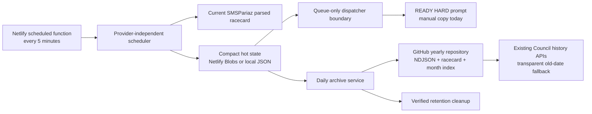

# HORSEE Scheduler and Hybrid Archive

HORSEE now has a provider-independent scheduler, compact operational state, verified yearly GitHub archives, safe legacy migration, and a read-only Equidia operations panel. It does not call ChatGPT, the OpenAI API, or another reasoning provider. A READY job contains a complete HARD prompt and stops at the `HorseeDispatcher` interface until a provider adapter is deliberately configured.

## Architecture



The domain modules live in `server/`. Netlify functions are thin HTTP or cron adapters. The React client makes one public, no-store status request every 30 seconds and never receives a mutation credential.

## Daily lifecycle

1. The scheduler acquires a short expiring lease.
2. It fetches the existing direct SMSPariaz racecard and requires its programme date to equal the current Mauritius date.
3. It rejects duplicate/inconsistent identities and invalid 24-hour Mauritius off-times, then reconciles one deterministic job per `${programme_date}:${race_id}` without resetting completed or in-flight work.
4. At 44–30 minutes before off, a job becomes `READY/PRIMARY`. At 29–15 minutes it becomes `READY/RECOVERY`. Boundaries are inclusive and the clock is truncated to a minute.
5. A READY transition creates the complete, deterministic fresh-session HARD prompt once. A later authoritative time/course/context revision is recorded with a source revision and refreshes only an unhanded prompt; dispatched, running, and saved evidence is never reset. The default queue-only dispatcher makes no provider or browser call.
6. A matching validated Council result moves the job to `SAVED`. After the day, the archive task writes one deterministic daily batch.
7. Hot data becomes deletable only after remote read-back verification and only after the configured Mauritius-calendar retention period.

The scheduler is idempotent. Repeated or overlapping invocations use an owned lease plus ETag compare-and-swap writes. Expired leases can be taken over; a stale owner cannot release the new owner's lease.

## Job states

| State | Meaning | Normal next states |
|---|---|---|
| `PENDING` | Race exists but is outside its analysis window | `READY`, `MISSED`, `SAVED` |
| `READY` | Stable HARD prompt is available | `DISPATCHED`, `FAILED`, `SAVED` |
| `DISPATCHED` | A future provider acknowledged handoff | `RUNNING`, `FAILED`, `SAVED` |
| `RUNNING` | Provider/operator reports active work | `FAILED`, `SAVED` |
| `SAVED` | A matching strict Council result exists | terminal |
| `FAILED` | Retryable bounded failure | `READY`, `MISSED`, `SAVED` |
| `MISSED` | Recovery cutoff passed or source race was removed | `READY` only under late/recovery policy, or `SAVED` |

Archive days move through `PENDING → ARCHIVING → ARCHIVED`. A failure becomes `FAILED`, preserves every source object, and can be retried. `ARCHIVED` is recorded only after the result, racecard, and index read back and validate.

## Storage model

Production uses strongly read, deploy-isolated Netlify Blob stores:

- Council production: `horsee-council-results-production`
- Scheduler production: `horsee-scheduler-production`
- Deploy Preview and branch deploy stores include their deploy/branch identity and cannot write production state.

Council hot storage contains:

```text
latest.json                         rebuildable latest result
recent.json                         bounded newest current results (default 100)
days/YYYY-MM-DD.json                one current result per race for a hot day
private-audit/...                   bounded write audit (newest 500)
results/...                         read-only legacy migration sources
migration/days/YYYY-MM-DD.json      verified migration marker
```

Scheduler hot storage contains:

```text
scheduler-state.json
jobs/YYYY-MM-DD.json
racecards/YYYY-MM-DD.json
archive-days/YYYY-MM-DD.json
locks/*.json
```

Local development uses atomic JSON replacement under `.netlify/`. Saving the same Mauritius date/race replaces its current result; it no longer creates an unlimited permanent object. Existing `save`, latest, history, exact-date, month-count, MCP, OAuth, and dashboard envelopes remain compatible. Exact dates that have left hot storage are read from GitHub, and hot corrections override archived month counts.

## Yearly GitHub archive

Repository names are `${HORSEE_GITHUB_ARCHIVE_OWNER}/${HORSEE_GITHUB_ARCHIVE_PREFIX}${year}`. Defaults produce `Kassix007/horsee-archive-2026`, then a new repository for each year.

```text
results/YYYY/MM/YYYY-MM-DD.ndjson   one complete CouncilResult per line
racecards/YYYY/MM/YYYY-MM-DD.json   exact compact parsed scheduler racecard
indexes/YYYY/MM.json                day discovery/count/path/hash index
```

Results are schema-validated, deduplicated by Mauritius date and exact race ID, ordered by racecard meeting/race order, serialized deterministically, and hashed with SHA-256. The service performs bounded GitHub Contents API GET/PUT requests. It creates missing files, supplies the current SHA for updates, retries bounded conflicts/transient failures, and performs no write when bytes already match. GitHub blob SHAs are never treated as HORSEE's content digest.

### Repository setup

1. Create the current and forthcoming yearly repositories, for example `Kassix007/horsee-archive-2026` and `Kassix007/horsee-archive-2027`.
2. Public repositories allow credential-free historical reads. Private repositories also need the configured token for reads.
3. Create a fine-grained GitHub token restricted to the yearly archive repositories with repository Contents read/write permission. Do not grant account-wide administration.
4. Store it only as the server-side Netlify environment variable `HORSEE_GITHUB_TOKEN`; never prefix it with `VITE_`.
5. Run an authorized explicit archive for a completed date and verify all three paths plus `/api/horsee/archive/status` before enabling cleanup.

## Environment variables

All values are server-side unless explicitly described otherwise.

| Variable | Default | Purpose |
|---|---:|---|
| `HORSEE_GITHUB_ARCHIVE_OWNER` | `Kassix007` | Yearly repository owner |
| `HORSEE_GITHUB_ARCHIVE_PREFIX` | `horsee-archive-` | Repository prefix |
| `HORSEE_GITHUB_TOKEN` | unset | Least-privilege archive write credential; absence is supported |
| `HORSEE_GITHUB_API_VERSION` | `2022-11-28` | GitHub REST version header |
| `HORSEE_GITHUB_TIMEOUT_MS` | `10000` | Per-request timeout, 1–30 seconds |
| `HORSEE_HOT_RETENTION_DAYS` | `14` | Previous Mauritius days retained in hot storage, plus today |
| `HORSEE_RECENT_RESULT_LIMIT` | `100` | Bounded recent Council cache |
| `HORSEE_PRIMARY_MIN_MINUTES` | `30` | Inclusive primary-window lower bound |
| `HORSEE_PRIMARY_MAX_MINUTES` | `44` | Inclusive primary-window upper bound |
| `HORSEE_RECOVERY_MIN_MINUTES` | `15` | Inclusive recovery lower bound |
| `HORSEE_RECOVERY_MAX_MINUTES` | `29` | Inclusive recovery upper bound |
| `HORSEE_ALLOW_LATE_ANALYSIS` | `false` | Permit late recovery before off |
| `HORSEE_SCHEDULER_API_KEY` | unset | Optional server-only bearer for external/operator mutations |
| `HORSEE_SCHEDULER_LOCK_SECONDS` | `240` | Expiring operational lease duration |
| `HORSEE_ARCHIVE_BATCH_DAYS` | `3` | Maximum completed dates processed per archive run |

The existing `HORSEE_MCP_RESOURCE`, `HORSEE_OAUTH_ISSUER`, `HORSEE_OAUTH_JWKS_URI`, and `HORSEE_OAUTH_WRITE_SCOPE` remain the browser/operator OAuth option. Mutation endpoints accept that verified Council write authorization or the scheduler key. If archive credentials are absent, scheduling, queue reads, Council saves, MCP, and dashboard operation continue; archive status is `NOT_CONFIGURED`.

Configuration is strict and fail-fast. Recovery and primary windows cannot overlap or be inverted. Secrets are redacted from error responses/log summaries and are never returned in jobs, prompts, MCP structured output, or browser assets.

## Netlify schedules and APIs

`netlify/functions/horsee-scheduler.ts` declares `*/5 * * * *`. `netlify/functions/horsee-archive.ts` declares `30 22 * * *`, which is 02:30 the next day in Mauritius (UTC+4). Scheduled functions are intentionally not mapped to public routes.

Public reads:

```text
GET /api/horsee/scheduler/status
GET /api/horsee/jobs/today
GET /api/horsee/jobs/ready
GET /api/horsee/jobs/next
GET /api/horsee/archive/status
```

Authorized mutations:

```text
POST /api/horsee/scheduler/run
POST /api/horsee/jobs/{encoded-id}/dispatch
POST /api/horsee/jobs/{encoded-id}/status
POST /api/horsee/archive/run
POST /api/horsee/archive/cleanup
```

If the selected Netlify plan cannot provide the five-minute cadence, call `POST /api/horsee/scheduler/run` from an external scheduler with `Authorization: Bearer <HORSEE_SCHEDULER_API_KEY>`. Invocation timing need not land on an exact minute because eligibility uses inclusive windows and current persisted state. Keep the key only in the external scheduler's secret store.

Manual examples:

```bash
curl https://your-site.example/api/horsee/scheduler/status
curl -X POST -H "Authorization: Bearer $HORSEE_SCHEDULER_API_KEY" \
  https://your-site.example/api/horsee/scheduler/run
curl -X POST -H "Authorization: Bearer $HORSEE_SCHEDULER_API_KEY" \
  -H "Content-Type: application/json" -d '{"date":"2026-08-22"}' \
  https://your-site.example/api/horsee/archive/run
```

## Safe legacy migration

Migration enumerates old flat and dated `results/**` objects, validates each with `CouncilResultSchema`, derives the date from `analysed_at` in `Indian/Mauritius`, and deterministically keeps the newest result for each date/race. Timestamp ties use the source key. Invalid keys are reported and never deleted.

Start with local fixtures or a production-connected dry run:

```powershell
npm run migrate:horsee -- --dry-run

$env:HORSEE_MIGRATION_PRODUCTION = "true"
$env:NETLIFY_SITE_ID = "your-site-id"
$env:NETLIFY_AUTH_TOKEN = "a-local-operator-token"
$env:HORSEE_GITHUB_TOKEN = "a-fine-grained-github-token"
npm run migrate:horsee -- --dry-run
```

Review every invalid record and planned day. Then run without `--dry-run`. Source objects remain untouched by default:

```powershell
npm run migrate:horsee
```

Only after validating the generated yearly repositories should deletion be requested:

```powershell
npm run migrate:horsee -- --delete-after-verified
```

Deletion is limited to exact source keys for dates whose archive was written, read back, validated, and marked. A failed/unverifiable date deletes zero keys. Reruns are safe and identical archive bytes are no-ops.

Legacy Council objects did not retain the parsed racecard used at analysis time. For those dates only, the normal racecard path contains a strict `legacy-reconstruction` manifest derived from the validated results and explicitly states that the original parsed card was unavailable. All newly scheduled dates archive the exact parsed SMSPariaz snapshot.

Unset local operator tokens after migration. They are not deployment configuration.

## Failure recovery

- **Stale/unavailable SMSPariaz card:** no queue is reconciled from it; scheduler state records a bounded failure. Retry after the source recovers.
- **Scheduler overlap:** the second invocation returns `scheduler_busy`; the active or eventual expired lease prevents permanent disablement.
- **GitHub unavailable/rate-limited/conflict:** archive state becomes retryable `FAILED`; hot and legacy data remain. Rerun archive after service recovery.
- **Partial archive batch:** result/racecard/index writes are repaired idempotently on the next run. The date is not `ARCHIVED` until all remote bytes verify.
- **Archive not configured:** normal HORSEE operation continues. Configure the token and run archive catch-up before retention.
- **Cleanup concern:** run archive verification/status first. Cleanup accepts no arbitrary key/path and removes only verified expired dates.
- **Dashboard polling failure:** the panel displays an error and retains the last good status snapshot.

Logs intentionally contain dates, state counts, race identities, transitions, recovery modes, source changes/removals, already-completed totals, hashes/no-op decisions, and sanitized summaries—not prompts, result bodies, bearer headers, tokens, or provider transcripts.

## Future dispatcher integration

Implement `HorseeDispatcher` in a new server-only adapter and inject it through `createHorseeRuntime`. Keep provider authentication and result polling inside that adapter. Use the deterministic job ID as the provider idempotency key. Return the strict accepted/retryable dispatch result, move a job to `DISPATCHED` only after acknowledged handoff, and use the authorized status route for later `RUNNING`, `FAILED`, or verified `SAVED` transitions. Do not import a provider SDK into the scheduler or place provider credentials in prompts/client code.

Full transcripts are intentionally not a permanent dependency. The durable record is the strict Council result, exact/reconstructed card metadata, content hash, month index, and compact scheduler/archive state.

## Verification

```bash
npm run test:mcp
npx eslint server netlify/functions src scripts
npm run build
npx netlify dev
```

With Netlify Dev, open `http://localhost:8888/#/equidia`. Verify the status panel and copy feedback at 375, 768, and 1280 pixels, keyboard focus visibility, no page-level horizontal overflow, public failure states, and unchanged Council/MCP behavior. The feature specification, contracts, evidence, and task ledger are under `specs/011-horsee-scheduler-archive/`.
