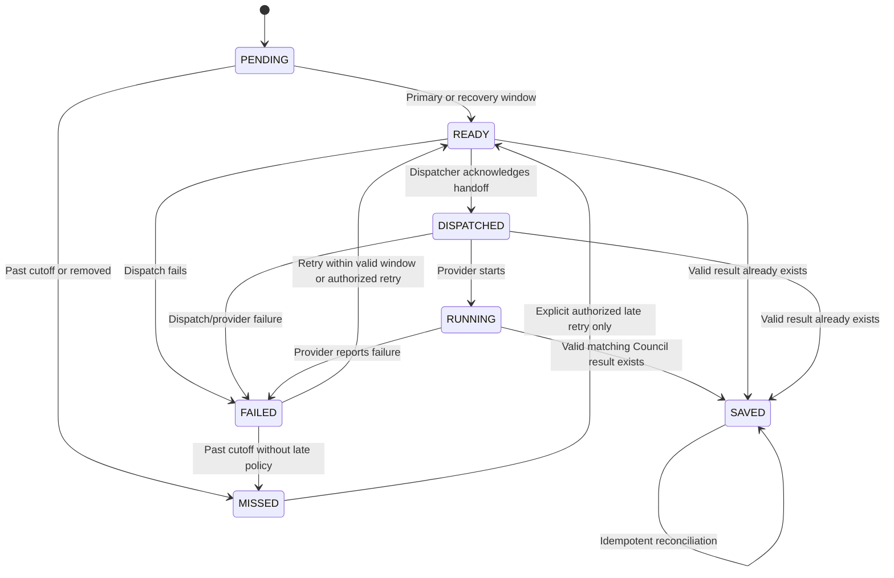
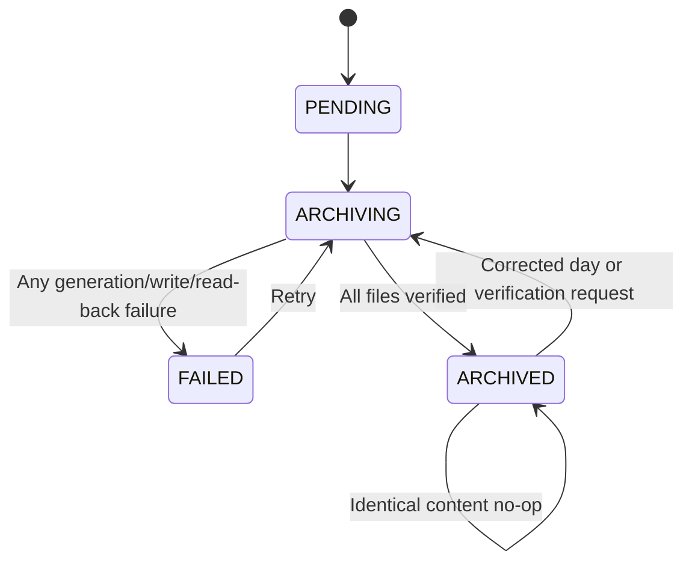

# Data Model: Long-Term HORSEE Scheduler and Hybrid Archive

All calendar dates and race-time calculations use `Indian/Mauritius`. ISO timestamps are server-generated and include an offset or `Z`. Every persisted object is validated with a strict Zod schema before use.

## HorseeJob

One deterministic work item for one race on one programme date.

| Field | Type | Rules |
|-------|------|-------|
| `id` | string | Exactly `${programme_date}:${race_id}`; maximum 200 characters |
| `programme_date` | `YYYY-MM-DD` | Valid Mauritius programme date |
| `race_id` | string | Must match the authoritative racecard race ID |
| `meeting_number` | positive integer | Copied from racecard |
| `race_number` | positive integer | Copied from racecard |
| `racecourse` | non-empty string | Copied from racecard; bounded length |
| `off_time_mauritius` | `HH:mm` | 24-hour minute precision |
| `created_at` | ISO timestamp | Immutable after creation |
| `updated_at` | ISO timestamp | Monotonic for accepted transitions |
| `status` | enum | `PENDING`, `READY`, `DISPATCHED`, `RUNNING`, `SAVED`, `FAILED`, `MISSED` |
| `mode` | enum or null | `PRIMARY`, `RECOVERY`, or null before eligibility |
| `source_status` | enum | `ACTIVE` or `REMOVED`; detects programme reconciliation changes |
| `source_revision` | non-negative integer | Increments only when authoritative race context changes, is removed, or is restored |
| `source_changed_at` | ISO timestamp, optional | Time of the most recent authoritative source change |
| `source_change_fields` | enum array, optional | Most recent changed fields: meeting/race number, racecourse, off-time, restored, or removed |
| `attempts` | non-negative integer | Incremented on an actual dispatch/run attempt or recorded failure |
| `prompt` | string, optional | Present only for READY or later work; bounded and self-contained |
| `dispatched_at` | ISO timestamp, optional | Required once dispatch is acknowledged |
| `completed_at` | ISO timestamp, optional | Required for SAVED; may be recorded for terminal manual outcomes |
| `last_error` | string, optional | Concise, sanitized, bounded diagnostic |

### Identity and update rules

- Identity is exact and case-preserving: `programme_date + ":" + race_id`.
- Reconciliation may update authoritative race metadata and `updated_at`, but never changes `id`, `programme_date`, `race_id`, or `created_at`.
- Prompt generation occurs once on transition into READY. Repeated eligible runs retain identical prompt bytes. A material authoritative source revision invalidates an unhanded READY prompt and creates a fresh prompt from the revised context if the race remains eligible.
- A race removed from an updated programme sets `source_status=REMOVED`; a pending/failed unprocessed job becomes MISSED, while dispatched/running/saved evidence is preserved.
- Duplicate race identities, identity/context mismatches, inconsistent race counts, and non-24-hour Mauritius off-times are rejected before the racecard or queue is persisted.

### State transitions

Invalid state changes are rejected. `SAVED` cannot be set solely from a client-supplied status; the result store must contain a schema-valid matching result.

## HorseeDailyQueue

One CAS-updated operational document per Mauritius date.

| Field | Type | Rules |
|-------|------|-------|
| `programme_date` | `YYYY-MM-DD` | Matches every contained job |
| `timezone` | literal | `Indian/Mauritius` |
| `source` | URL string | SMSPariaz source identifier |
| `programme_fetched_at` | ISO timestamp | From the exact stored racecard snapshot |
| `created_at` | ISO timestamp | First queue creation |
| `updated_at` | ISO timestamp | Last successful reconciliation/transition |
| `revision` | non-negative integer | Incremented on every accepted persisted mutation |
| `jobs` | record of job ID to `HorseeJob` | Record key must equal `job.id`; unique date/race |

Derived summaries are computed from one validated queue snapshot rather than persisted redundantly.

## HorseeQueueSummary

A secret-free projection for APIs and dashboard rendering.

| Field | Type | Rules |
|-------|------|-------|
| `programme_date` | date | Queue date |
| `timezone` | literal | `Indian/Mauritius` |
| `observed_at` | ISO timestamp | Projection time |
| `last_run_at` | ISO timestamp or null | Last scheduler completion |
| `revision` | integer | Source queue revision |
| `counts.programme` | integer | Total jobs retained for the programme |
| `counts.completed` | integer | SAVED count |
| `counts.ready` | integer | READY count |
| `counts.pending` | integer | PENDING count |
| `counts.failed` | integer | FAILED count |
| `counts.missed` | integer | MISSED count |
| `counts.dispatched` | integer | DISPATCHED count |
| `counts.running` | integer | RUNNING count |
| `upcoming_jobs` | job projection array | Sorted by off-time, meeting, race; bounded to a dashboard limit |
| `archive` | `HorseeArchiveHealth` | Sanitized current archive health |
| `last_error` | string or null | Sanitized scheduler error only |

Job projections exclude internal lease/store metadata. A prompt is returned only when the job status is READY and the prompt is non-empty.

## HorseeSchedulerState

Compact cross-run metadata independent from the daily queue.

| Field | Type | Rules |
|-------|------|-------|
| `current_programme_date` | date or null | Most recently reconciled current date |
| `last_run_at` | ISO timestamp or null | Last completed invocation |
| `last_success_at` | ISO timestamp or null | Last successful current-card reconciliation |
| `last_error_at` | ISO timestamp or null | Last failed invocation |
| `last_error` | string or null | Concise sanitized failure |
| `last_programme_race_count` | non-negative integer | Count from last valid card |
| `updated_at` | ISO timestamp | State write time |

Scheduler errors update this record but never delete or terminally disable later runs.

## HorseeOperationalLease

An expiring coordination record stored under a fixed operation key.

| Field | Type | Rules |
|-------|------|-------|
| `owner` | UUID | Unique per invocation |
| `purpose` | enum | `SCHEDULER`, `ARCHIVE`, `CLEANUP`, or `MIGRATION` |
| `acquired_at` | ISO timestamp | Server clock |
| `expires_at` | ISO timestamp | Later than acquisition and within configured maximum |

Creation uses `onlyIfNew`. An expired lease may be replaced only with its observed ETag. Release/expiry verifies ownership so a stale owner cannot remove a successor's lease.

## StoredRacecardSnapshot

The exact validated `SmspariazRacecardSuccess` used for a daily reconciliation. Its existing fields remain authoritative:

- `programme_date`, `timezone`, `fetched_at`, `source`
- meeting/race/French-race counts
- complete strict `meetings[]` and `races[]`

The snapshot is stored once per successful reconciliation and may be replaced only by a newer valid card for the same date.

## CouncilHotDay

Canonical current results for one Mauritius date.

| Field | Type | Rules |
|-------|------|-------|
| `programme_date` | `YYYY-MM-DD` | Derived with existing Mauritius history logic |
| `updated_at` | ISO timestamp | Last accepted save for the day |
| `results` | record of race ID to `CouncilResult` | Every value passes authoritative `CouncilResultSchema`; key equals `result.race_id` |

`save()` validates, reads with metadata, replaces `results[race_id]`, and CAS-writes the day. `latest.json` and `recent.json` are derived caches and are not used to decide whether a day was durably saved.

## CouncilRecentCache

| Field | Type | Rules |
|-------|------|-------|
| `updated_at` | ISO timestamp | Cache rebuild time |
| `limit` | positive integer | Parsed central configuration |
| `results` | `CouncilResult[]` | Unique by Mauritius date/race, newest analysed first, length at most limit |

## HorseeArchiveDayState

Retryable local verification state for one programme date.

| Field | Type | Rules |
|-------|------|-------|
| `date` | `YYYY-MM-DD` | Archive date |
| `status` | enum | `PENDING`, `ARCHIVING`, `ARCHIVED`, `FAILED` |
| `repo` | `owner/repository` | Year derived from date |
| `result_path` | string, optional | `results/YYYY/MM/YYYY-MM-DD.ndjson` |
| `racecard_path` | string, optional | `racecards/YYYY/MM/YYYY-MM-DD.json` |
| `index_path` | string, optional | `indexes/YYYY/MM.json` |
| `started_at` | ISO timestamp, optional | Latest attempt start |
| `archived_at` | ISO timestamp, optional | Required only for verified ARCHIVED state |
| `result_count` | non-negative integer, optional | Valid unique daily result count |
| `race_count` | non-negative integer, optional | Snapshot race count |
| `content_hash` | 64-char lowercase hex, optional | SHA-256 of canonical NDJSON |
| `last_error` | bounded string, optional | Sanitized; absent/cleared on success |
| `attempts` | non-negative integer | Increments when an archive attempt begins |

### Archive transitions

Only `ARCHIVED` with matching remote content is cleanup-eligible.

## HorseeArchiveIndex

One compact JSON object per archive month.

| Field | Type | Rules |
|-------|------|-------|
| `year` | integer | Four-digit year; matches path |
| `month` | integer | 1–12; matches path |
| `days` | record of date to entry | Each key belongs to the same year/month |

Each day entry contains:

- `race_count`: races on archived card
- `completed_count`: unique archived Council results
- `archive_file`: deterministic NDJSON path
- `racecard_file`: deterministic racecard JSON path
- `content_hash`: SHA-256 of NDJSON
- `archived_at`: verification timestamp

Updating one date preserves every other validated day entry and writes date keys in ascending order for deterministic bytes.

## HorseeArchiveHealth

Strict public projection:

| Field | Type |
|-------|------|
| `status` | `HEALTHY`, `DEGRADED`, or `NOT_CONFIGURED` |
| `last_archived_day` | date or null |
| `repo` | repository name (not owner/token) or null |
| `pending_days` | non-negative integer |
| `last_error` | sanitized bounded string or null |

`NOT_CONFIGURED` is neutral and does not change scheduler health.

## GitHubArchiveFile

Internal remote-read result:

| Field | Type | Rules |
|-------|------|-------|
| `path` | string | Requested repository path |
| `sha` | string | GitHub blob SHA; never used as HORSEE content digest |
| `content` | string | Decoded UTF-8 bytes |

Write result is `CREATED`, `UPDATED`, or `UNCHANGED`, with repository/path and returned blob SHA. Structured errors expose status/category and sanitized message, never request headers, bearer token, raw provider body, or full file content.

## LegacyMigrationRecord

Internal representation used by the CLI:

| Field | Type | Rules |
|-------|------|-------|
| `source_key` | string | Original flat or dated Blob key |
| `programme_date` | date | Derived from validated `analysed_at` in Mauritius |
| `identity` | string | `${programme_date}:${race_id}` |
| `result` | `CouncilResult` | Authoritative validation passed |
| `analysed_epoch_ms` | non-negative integer | Used for newest-wins deduplication |

Malformed entries are reported separately and never enter archive generation. When timestamps tie, source key lexical order provides deterministic selection.

## Retention eligibility

A date can be removed from hot Council/job/racecard storage only when all conditions are true:

1. It is not today's Mauritius date.
2. It is older than the configured number of previous days.
3. Its local archive state is `ARCHIVED`.
4. Archive verification still confirms the expected result hash and required racecard/index references.
5. The date is not participating in a current unexpired archive/cleanup lease.

Cleanup preserves `latest.json`, rebuilds/retains the bounded recent cache, and never deletes legacy keys unless the migration CLI received `--delete-after-verified` for those exact verified source keys.
