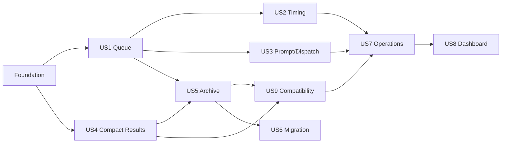

---

description: "Dependency-ordered implementation tasks for the HORSEE scheduler and hybrid archive"
---

# Tasks: Long-Term HORSEE Scheduler and Hybrid Archive

**Input**: Design documents from `specs/011-horsee-scheduler-archive/`

**Prerequisites**: `plan.md`, `spec.md`, `research.md`, `data-model.md`, `contracts/horsee-api.md`, `quickstart.md`

**Tests**: Required by the feature specification. Within each story, add failing tests before the related implementation and keep all existing regressions green.

**Organization**: Tasks are grouped by user story. P1 compatibility story US9 is scheduled before P2 work even though its story number is later.

## Format: `[ID] [P?] [Story] Description`

- **[P]**: Can run in parallel because it targets different files and does not depend on another incomplete task in the same phase
- **[Story]**: Maps to the numbered user story in `spec.md`
- Every task names its concrete repository path

## Phase 1: Setup (Shared Infrastructure)

**Purpose**: Establish the feature's source/test/documentation entry points without changing runtime behavior.

- [X] T001 Add the HORSEE migration command and include `scripts/migrate-council-history-to-archive.ts` in type checking via `package.json` and `tsconfig.mcp.json`
- [X] T002 [P] Add shared test fixture builders for Council results, racecards, clocks, and in-memory stores in `server/horsee-test-helpers.ts`
- [X] T003 [P] Add the scheduler/archive documentation skeleton linked from `README.md` in `docs/horsee-scheduler.md` and `README.md`

---

## Phase 2: Foundational (Blocking Prerequisites)

**Purpose**: Strict configuration, schemas, time arithmetic, and storage contracts required by every story.

**⚠️ CRITICAL**: No user-story implementation begins until these contracts pass tests.

- [X] T004 [P] Write central environment parsing/default/redaction tests in `server/horsee-config.test.ts`
- [X] T005 [P] Write strict job, queue, scheduler state, lease, archive state, index, and transition-schema tests in `server/horsee-job-schema.test.ts`
- [X] T006 [P] Write Mauritius race timestamp, wall-minute truncation, date subtraction, and midnight-boundary tests in `server/mauritius-time.test.ts`
- [X] T007 Implement strict central configuration with scheduler/archive defaults, cross-field window validation, optional credentials, and secret-free public projection in `server/horsee-config.ts`
- [X] T008 Implement HorseeJob, HorseeDailyQueue, HorseeSchedulerState, HorseeOperationalLease, HorseeArchiveDayState, HorseeArchiveIndex, and transition schemas in `server/horsee-job-schema.ts`
- [X] T009 Extend Mauritius date/time helpers without changing existing functions in `server/mauritius-time.ts`
- [X] T010 Define injected queue/result/archive store contracts, versioned value types, stable keys, and deploy-isolated scheduler namespace resolution in `server/horsee-job-store.ts`

**Checkpoint**: Shared types, configuration, and time behavior are validated and implementation stories can begin.

---

## Phase 3: User Story 1 - Build Today's Reliable Race Queue (Priority: P1) 🎯 MVP

**Goal**: Reconcile the current authoritative SMSPariaz card into one deterministic, idempotent daily queue and preserve progress across repeated, updated, failed, and overlapping runs.

**Independent Test**: Invoke the scheduler repeatedly and with simulated CAS/lease overlap against a current multi-meeting card; every race appears once, new races reconcile, completed work remains, removed work is observable, and stale cards create no jobs.

### Tests for User Story 1

- [X] T011 [P] [US1] Write deterministic identity, programme reconciliation, added/removed race, completed-preservation, and stale-card tests in `server/horsee-scheduler.test.ts`
- [X] T012 [P] [US1] Write strong-read CAS, conflict retry, expired lease takeover, stale owner release, and local atomic persistence tests in `server/horsee-job-store.test.ts`

### Implementation for User Story 1

- [X] T013 [US1] Implement Netlify Blob and local-file queue/racecard/scheduler-state persistence with ETag CAS retries and owned expiring leases in `server/horsee-job-store.ts`
- [X] T014 [US1] Implement pure race reconciliation, deterministic job creation, source-removal handling, stable ordering, and queue summaries in `server/horsee-scheduler.ts`
- [X] T015 [US1] Implement the injected scheduler orchestrator around `getSmspariazDailyRacecard()`, current-card validation, current results, stored snapshot, queue persistence, scheduler-state failures, and concise logs in `server/horsee-scheduler.ts`

**Checkpoint**: A current authoritative card produces exactly one durable job per race without any provider call.

---

## Phase 4: User Story 2 - Prepare Council Work at the Right Time (Priority: P1)

**Goal**: Apply inclusive primary/recovery timing windows at arbitrary invocation minutes, retry safely, and mark truly late work missed.

**Independent Test**: Evaluate 45, 44, 30, 29, 15, and 14 minutes before off plus Mauritius midnight and repeated invocations; states and modes match the spec with one prompt-ready transition.

### Tests for User Story 2

- [X] T016 [P] [US2] Add primary/recovery/pending/missed boundary, seconds truncation, midnight, failed retry, and already-in-flight non-redispatch cases to `server/horsee-scheduler.test.ts`

### Implementation for User Story 2

- [X] T017 [US2] Implement eligibility calculation, PRIMARY/RECOVERY modes, late-policy behavior, failed-job recovery, and SAVED reconciliation from validated matching results in `server/horsee-scheduler.ts`
- [X] T018 [US2] Add timing/recovery/attempt observability without prompt or result dumping in `server/horsee-scheduler.ts`

**Checkpoint**: Scheduling can run every five minutes or at arbitrary times and reliably recovers the entire defined window.

---

## Phase 5: User Story 3 - Hand Off Self-Contained Council Jobs (Priority: P1)

**Goal**: Generate stable self-contained HARD prompts and expose a provider-neutral queue-only dispatcher.

**Independent Test**: A fresh-session prompt contains the date, race, complete protocol, authoritative-source rule, and save instruction; repeated runs retain identical bytes and dispatch performs no model/browser call.

### Tests for User Story 3

- [X] T019 [P] [US3] Write prompt completeness, Mauritius date formatting, deterministic output, and size-bound tests in `server/horsee-prompt-builder.test.ts`
- [X] T020 [P] [US3] Write dispatcher contract, queue-only result, error sanitization, and no-state-change tests in `server/horsee-dispatch.test.ts`

### Implementation for User Story 3

- [X] T021 [P] [US3] Implement `buildHorseeHardPrompt()` with the complete fresh-session HARD protocol in `server/horsee-prompt-builder.ts`
- [X] T022 [P] [US3] Implement `HorseeDispatcher`, strict dispatch results, and `QueueOnlyDispatcher` in `server/horsee-dispatch.ts`
- [X] T023 [US3] Integrate one-time prompt generation and injected dispatch results with valid job transitions in `server/horsee-scheduler.ts`

**Checkpoint**: READY jobs are useful manually and future providers can be swapped behind one interface.

---

## Phase 6: User Story 4 - Keep Operational History Compact (Priority: P1)

**Goal**: Replace unbounded new Council-result objects with canonical day documents and bounded caches while preserving store method signatures.

**Independent Test**: Save the same date/race repeatedly, then query latest/history/date/count views; one canonical result remains, latest is correct, recent is bounded, and legacy objects are still readable without deletion.

### Tests for User Story 4

- [X] T024 [P] [US4] Add canonical day replacement, CAS conflict, latest/recent cache, bounded limit, and authoritative-schema rejection tests in `server/council-store.test.ts`
- [X] T025 [P] [US4] Add legacy flat/dated read merge and current-result precedence tests in `server/council-history.test.ts`

### Implementation for User Story 4

- [X] T026 [US4] Refactor production Council saves to CAS-upsert `days/YYYY-MM-DD.json` before rebuilding latest/recent caches while retaining bounded audit behavior in `server/council-store.ts`
- [X] T027 [US4] Refactor local Council storage to the same deterministic date/race semantics with atomic file replacement in `server/council-store.ts`
- [X] T028 [US4] Preserve `save()`, `getLatest()`, `getHistory()`, `getByDate()`, and `getDateCounts()` envelopes while merging canonical hot and unmigrated legacy reads in `server/council-store.ts`

**Checkpoint**: New production saves no longer create an unlimited per-race history object and existing callers compile unchanged.

---

## Phase 7: User Story 5 - Preserve Daily Results for Years (Priority: P1)

**Goal**: Create verified, deterministic daily yearly archives and remove only verified expired hot days.

**Independent Test**: Archive a completed fixture day twice; the first creates/updates deterministic results, racecard, and index files, the second is unchanged, failures preserve hot data, and cleanup removes only old verified dates.

### Tests for User Story 5

- [X] T029 [P] [US5] Write GitHub Contents GET/create/update/identical/404/409/422/429/5xx/timeout and token-redaction tests in `server/github-archive-client.test.ts`
- [X] T030 [P] [US5] Write NDJSON validation, racecard-joined ordering, hash, monthly index, partial-write repair, read-back verification, and archive-state tests in `server/horsee-archive.test.ts`
- [X] T031 [P] [US5] Write today/unarchived/failed/within-retention preservation and verified-expired deletion tests in `server/horsee-retention.test.ts`

### Implementation for User Story 5

- [X] T032 [P] [US5] Implement timed, bounded, sanitized GitHub Contents API read/upsert/no-op operations with built-in fetch in `server/github-archive-client.ts`
- [X] T033 [US5] Implement deterministic Council deduplication/order, NDJSON, SHA-256, racecard JSON, month index, and archive path helpers in `server/horsee-archive.ts`
- [X] T034 [US5] Implement `archiveDay()`, `archiveExpiredHotDays()`, `getArchiveRepository()`, and `verifyArchive()` with retryable state and logical batch repair in `server/horsee-archive.ts`
- [X] T035 [US5] Implement archive-day/state/racecard listing and verified hot-day deletion operations in `server/horsee-job-store.ts` and `server/council-store.ts`
- [X] T036 [US5] Implement `cleanupExpiredHotData()` with Mauritius calendar retention gates and cache preservation in `server/horsee-archive.ts`

**Checkpoint**: Completed days have verifiable yearly archives, identical reruns create no writes, and cleanup cannot remove unverified data.

---

## Phase 8: User Story 9 - Preserve Existing HORSEE Behavior (Priority: P1)

**Goal**: Keep MCP, OAuth, racecard, Council saves, and all existing public history consumers compatible after compact storage and retention.

**Independent Test**: Run all existing regressions and query an old cleaned date/month; current response envelopes remain unchanged and archived data is transparently returned.

### Tests for User Story 9

- [X] T037 [P] [US9] Add archive exact-date fallback, monthly index merge/no-double-count, unavailable-archive degradation, and response-envelope regressions in `server/council-store.test.ts` and `server/council-history.test.ts`
- [X] T038 [P] [US9] Extend MCP discovery/save/latest/history compatibility tests for one-current-result semantics without changing tool contracts in `server/horsee-mcp-discovery.test.ts` and `server/horsee-mcp-authorization.test.ts`

### Implementation for User Story 9

- [X] T039 [US9] Add validated archive day/index read support and hot-over-archive merge helpers in `server/horsee-archive.ts`
- [X] T040 [US9] Wire optional archive fallback into the Council store factory and exact-date/month reads without making archive credentials a startup dependency in `server/council-store.ts`
- [X] T041 [US9] Preserve existing Netlify Council adapters and MCP behavior while routing their storage dependencies through the compact/archive-aware factory in `netlify/functions/council-latest.ts`, `netlify/functions/council-today.ts`, `netlify/functions/council-history.ts`, `netlify/functions/council-history-dates.ts`, and `server/horsee-mcp.ts`

**Checkpoint**: All pre-feature HORSEE consumers work, including old calendar days that have left hot storage.

---

## Phase 9: User Story 6 - Recover and Migrate Existing History Safely (Priority: P2)

**Goal**: Provide a dry-runnable, idempotent, verify-before-delete migration for flat and dated legacy objects.

**Independent Test**: Migrate valid, duplicate, midnight, and malformed fixtures twice; newest valid date/race wins, invalids are reported, archives no-op on rerun, and source keys delete only with the explicit flag after per-day verification.

### Tests for User Story 6

- [X] T042 [P] [US6] Write legacy enumeration, validation, Mauritius grouping, deterministic newest-wins deduplication, rerun, and deletion-gate tests in `server/horsee-migration.test.ts`

### Implementation for User Story 6

- [X] T043 [US6] Implement pure legacy grouping/deduplication and per-day migration reporting in `server/horsee-migration.ts`
- [X] T044 [US6] Expose safe legacy enumeration, migration-marker, and exact verified-key deletion methods in `server/council-store.ts`
- [X] T045 [US6] Implement `--dry-run` and `--delete-after-verified` CLI orchestration with explicit summaries and no default deletion in `scripts/migrate-council-history-to-archive.ts`

**Checkpoint**: Existing production history has a safe, auditable path into yearly archives without automatic destruction.

---

## Phase 10: User Story 7 - Operate the Scheduler and Archive Securely (Priority: P2)

**Goal**: Expose read/status and authorized mutation endpoints plus reliable five-minute and daily scheduled adapters without leaking secrets.

**Independent Test**: Anonymous reads return sanitized state, anonymous mutations fail, OAuth or scheduler-key mutations succeed idempotently, missing archive config degrades cleanly, and scheduled adapters are thin and correctly configured.

### Tests for User Story 7

- [X] T046 [P] [US7] Write OAuth/scheduler-key authentication, constant-time mismatch, method, body, state-transition, redaction, and response-contract tests in `server/horsee-api-security.test.ts`
- [X] T047 [P] [US7] Write Netlify redirect, five-minute scheduler cron, daily archive cron, and scheduled-versus-path separation tests in `server/netlify-horsee-config.test.ts`

### Implementation for User Story 7

- [X] T048 [US7] Implement shared mutation authorization using existing Council OAuth or optional server-only scheduler bearer key in `server/horsee-api-auth.ts`
- [X] T049 [P] [US7] Implement scheduler status and authorized run routing in `netlify/functions/horsee-scheduler-api.ts`
- [X] T050 [P] [US7] Implement today/ready/next/dispatch/status job routing and transition validation in `netlify/functions/horsee-jobs.ts`
- [X] T051 [P] [US7] Implement archive status/run/cleanup routing in `netlify/functions/horsee-archive-api.ts`
- [X] T052 [P] [US7] Implement the `*/5 * * * *` thin scheduled adapter in `netlify/functions/horsee-scheduler.ts`
- [X] T053 [P] [US7] Implement the daily thin archive/catch-up/cleanup scheduled adapter in `netlify/functions/horsee-archive.ts`
- [X] T054 [US7] Add specific read/mutation redirects and scheduled function configuration without exposing scheduled adapters as URLs in `netlify.toml`

**Checkpoint**: Operations are observable and recoverable, mutations are fail-closed, and hosting/provider details do not enter core logic.

---

## Phase 11: User Story 8 - See Operational Health on Equidia (Priority: P2)

**Goal**: Add a responsive, accessible, read-only scheduler/archive panel with upcoming jobs and copyable READY prompts to the current Equidia Council area.

**Independent Test**: Seed all job/archive states, load Equidia at 375/768/1280 pixels, copy a READY prompt by keyboard, and verify accurate counts, last-good-data behavior, archive degradation, no overflow, visible focus, and no secret/mutation credential.

### Tests for User Story 8

- [X] T055 [P] [US8] Add strict dashboard DTO guard, malformed payload, job ordering, archive-not-configured, and sanitized error tests in `server/horsee-dashboard-contract.test.ts`

### Implementation for User Story 8

- [X] T056 [P] [US8] Implement browser DTO types, complete runtime guards, no-store status loading, and abort support in `src/services/horsee.ts`
- [X] T057 [US8] Implement `HorseeSchedulerDashboard` with one 30-second/focus refresh, last-good snapshot, semantic metrics/jobs/archive health, and clipboard live feedback in `src/components/council/HorseeSchedulerDashboard.tsx`
- [X] T058 [US8] Insert the scheduler panel after the manual Council console without changing the MCP widget, player, Selection Board, or Council archive in `src/pages/Equidia.tsx`
- [X] T059 [US8] Add text-plus-color states, visible focus, 44px controls, wrapping, and 680/420px stacking in `src/pages/Equidia.css`

**Checkpoint**: A dashboard user can understand daily operations and copy any READY prompt in under 30 seconds without receiving a secret.

---

## Phase 12: Polish and Cross-Cutting Validation

**Purpose**: Finish production documentation, regression checks, browser QA, and spec evidence.

- [X] T060 [P] Complete architecture, lifecycle, state, storage, configuration, repository setup, migration, recovery, invocation, security, and provider-integration documentation in `docs/horsee-scheduler.md`
- [X] T061 [P] Update concise runtime/storage/environment/migration references and the changed one-current-result behavior in `README.md`
- [X] T062 Audit new server/function/frontend output and logs for secrets, prompt/result dumping, unbounded errors, unsupported browser automation, and accidental model calls across `server/`, `netlify/functions/`, `src/`, and `scripts/`
- [X] T063 Run `npm run test:mcp`, fix all failures, and record the final test count in `specs/011-horsee-scheduler-archive/spec.md`
- [X] T064 Run `npx eslint server netlify/functions src scripts` and `npm run build`, fix all failures, and record final build/lint evidence in `specs/011-horsee-scheduler-archive/spec.md`
- [X] T065 Run the `quickstart.md` Netlify Dev/browser checks at 375, 768, and 1280 pixels, verify copy and failure states, and record evidence in `specs/011-horsee-scheduler-archive/spec.md`
- [X] T066 Reconcile delivered files and behavior against every acceptance criterion, update remaining work if any in `specs/011-horsee-scheduler-archive/tasks.md`, and set the spec status accurately in `specs/011-horsee-scheduler-archive/spec.md`

---

## Dependencies and Execution Order

### Phase dependencies

- **Setup (Phase 1)**: No dependencies.
- **Foundational (Phase 2)**: Depends on Setup and blocks every user story.
- **US1 Queue (Phase 3)**: Depends on Foundational.
- **US2 Timing (Phase 4)**: Depends on US1 queue reconciliation/orchestrator.
- **US3 Prompt/Dispatch (Phase 5)**: Depends on US1 job lifecycle; can begin alongside US2 after T015.
- **US4 Compact Results (Phase 6)**: Depends on Foundational; may proceed alongside US1–US3 after T010.
- **US5 Archive/Retention (Phase 7)**: Depends on US1 job/racecard storage and US4 compact results.
- **US9 Compatibility (Phase 8)**: Depends on US4 and US5 archive reads.
- **US6 Migration (Phase 9)**: Depends on US5 archive service and US4 legacy access.
- **US7 Secure Operations (Phase 10)**: Depends on US1–US5 core services and US9 compatibility factory wiring.
- **US8 Dashboard (Phase 11)**: Depends on the US7 public status contract; frontend service work may start against `contracts/horsee-api.md` earlier.
- **Polish (Phase 12)**: Depends on every selected story.

### User story dependency graph



### Within each user story

- Write the listed tests first and confirm they fail for the missing behavior.
- Implement strict models/pure helpers before adapters.
- Persist canonical data before rebuilding caches or exposing endpoints.
- Verify remote archive bytes before local archived state or deletion.
- Complete the independent checkpoint before marking story tasks done.

## Parallel Opportunities

- T002 and T003 can run together after T001.
- T004–T006 can run together; T007–T009 then implement their separate files.
- US1 scheduler tests and job-store tests (T011–T012) can be written together.
- After T015, US2 and US3 test/implementation files can proceed in parallel.
- US4 compact-result work can proceed alongside US1–US3 once foundational contracts exist.
- GitHub client tests/implementation and archive pure-generation tests can proceed in parallel within US5 before orchestration.
- US7's three HTTP adapters and two scheduled adapters target distinct files after shared auth is complete.
- US8 browser service work can begin from the written contract while the server route is being completed.
- Documentation T060/T061 can proceed together after runtime behavior stabilizes.

## Parallel Example: Scheduler and Compact Storage

```text
Task: T011 [US1] Write scheduler reconciliation tests in server/horsee-scheduler.test.ts
Task: T012 [US1] Write CAS/lease store tests in server/horsee-job-store.test.ts
Task: T024 [US4] Write compact Council store tests in server/council-store.test.ts
```

## Parallel Example: Archive

```text
Task: T029 [US5] Write GitHub client tests in server/github-archive-client.test.ts
Task: T030 [US5] Write archive generation/verification tests in server/horsee-archive.test.ts
Task: T031 [US5] Write retention tests in server/horsee-retention.test.ts
```

## Parallel Example: Operations and Dashboard

```text
Task: T049 [US7] Implement scheduler HTTP adapter in netlify/functions/horsee-scheduler-api.ts
Task: T050 [US7] Implement jobs HTTP adapter in netlify/functions/horsee-jobs.ts
Task: T051 [US7] Implement archive HTTP adapter in netlify/functions/horsee-archive-api.ts
Task: T056 [US8] Implement browser client contract in src/services/horsee.ts
```

## Implementation Strategy

### MVP first

1. Complete Setup and Foundational phases.
2. Complete US1 queue reconciliation.
3. Validate one durable deterministic job per current race with no provider call.
4. Add US2 timing and US3 prompt/dispatch to make the queue operational.

### Incremental production path

1. **Operational core**: Foundation + US1 + US2 + US3.
2. **Bounded hot state**: US4.
3. **Safe durable history**: US5, then US9 compatibility.
4. **Adoption**: US6 migration.
5. **Operations**: US7 secure adapters and schedules.
6. **Human control surface**: US8 dashboard.
7. **Release gate**: all polish/verification tasks.

## Notes

- The public Equidia UI is intentionally copy-only until browser OAuth exists.
- The MCP Apps widget remains unchanged and keeps its current empty network CSP.
- GitHub Contents writes are a small daily logical batch, not one commit per race; partial batches remain retryable.
- Automated tests never call live SMSPariaz, Netlify, GitHub, OAuth, or a reasoning provider.
- Legacy deletion is destructive and must remain behind the explicit verified CLI flag.

## Phase 13: Convergence

- [X] T067 Reject duplicate race identities and semantically invalid Mauritius off-times before queue reconciliation, with focused scheduler validation regressions, per FR-003 and the programme edge cases (partial)
- [X] T068 Persist and log an observable authoritative-source change when race timing or identity context changes, and prevent a READY job from retaining a stale prompt, per FR-006 and US1/AC3 (partial)
- [X] T069 Expand scheduler observability tests and implementation to identify job transitions, recovery decisions, already-completed work, removals, and concise counts without prompt/result dumping, per FR-057 (partial)
- [X] T070 Add literal scale/error regressions for 1,000 same-race saves, ten identical archive reruns, and an aborted GitHub timeout, per SC-005, SC-007, FR-066, and T029 (partial)
